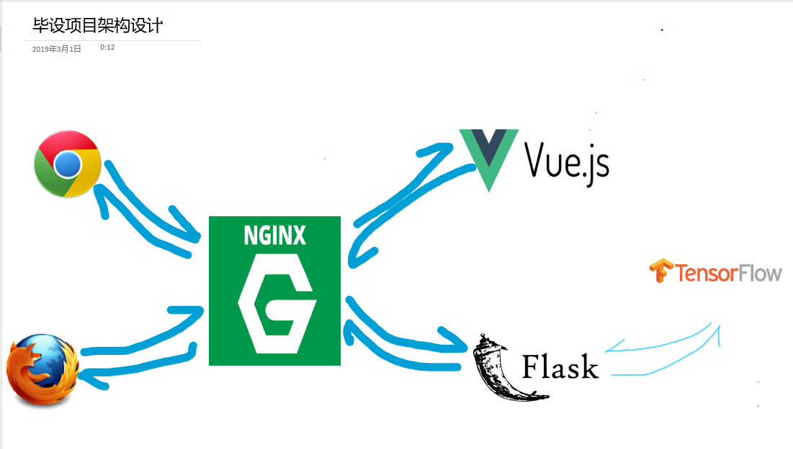

## About 

一个关于人脸检测系统的毕设和论文， 使用web进行呈现，前后端分离，python 语言开发。

#### 架构设计

#### 前端说明

使用Vue全家桶 + Element UI  进行开发, 详情戳[这里](./code/front-web/README.md)

#### 后端

使用Python Flask 框架开发,

#### 检测模型

使用MTCNN 人脸检测， 详情见 [这里](./code/mtcnn/Readme.md)

