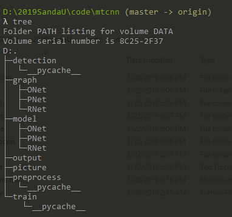
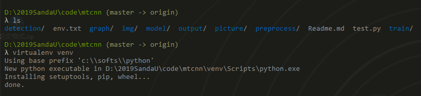
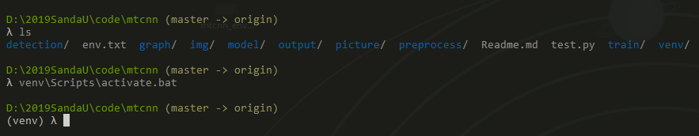
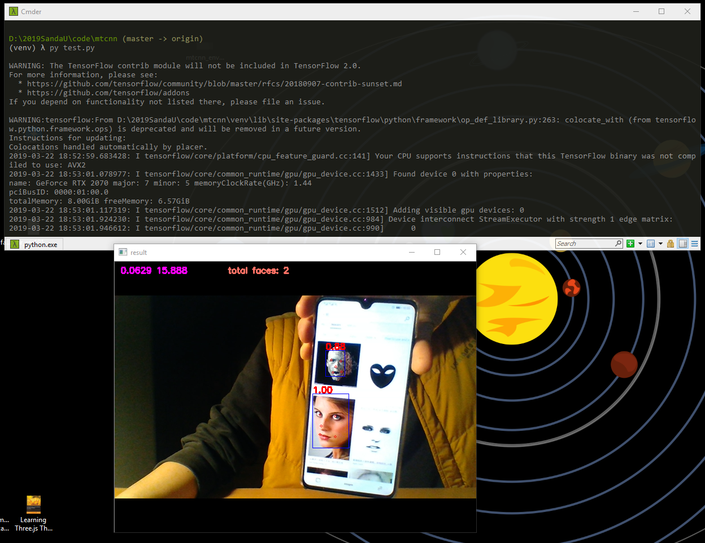

#### About

后台使用的MTCNN 模型相关代码和训练后的model。

- 目录结构：



- 说明

  **model**, **graph** : 训练后的神经网络模型和相关参数权重

  **detection**, **train**, **preprocess** : 训练时使用的相关代码

  **output**, **picture**: 测试输出目录

- 具体py 脚本说明

  - detection:

    **fcn_detector.py**主要用于**PNet**的单张图片识别,

    **detector.py**用于**RNet**和**ONet**的一张图片通过PNet截取的多个人脸框的批次识别,

    **MtcnnDetector.py**为识别人脸和生成**RNet**,**ONet**输入数据

  - preprocess:

    **BBox_utils.py**和**utils.py**,**loader.py**是辅助程序，

    **gen_12net_data.py**是生成**PNet**的**pos**,**neg**,**part**的程序,

    **gen_landmark_aug.py**是生成**landmark**数据的程序,

    **gen_imglist_pnet.py**是**pnet**的四种数据组合一起,

    **gen_hard_example.py**是生成**rnet**,**onet**的三种数据程序,

    **gen_tfrecords.py**是生成**tfrecord**文件的程序

  - graph

    训练过程中生成的graph文件

  - output

    识别图像或视频完成后存储放置的路径

  - picture

    测试的图像放置路径

  - train

    **model.py** 模型

    **train.py** 训练

    **train_model.py **针对不同网络训练

    **test.py ** 测试代码

- 数据&训练

  - 下载

    将[WIDERFace](http://mmlab.ie.cuhk.edu.hk/projects/WIDERFace/)的训练数据下载解压，将里面的WIDER_train文件夹放置到data下，将[Deep Convolutional Network Cascade for Facial Point Detection的训练集](http://mmlab.ie.cuhk.edu.hk/archive/CNN_FacePoint.htm)解压，将里面的lfw_5590和net_7876文件夹放置到data下。model文件夹下已存储好我训练的权值文件了。

  - 训练
    preprocess目录下:

    ```
    > python gen_12net_data.py 生成三种pnet数据
    > python gen_landmark_aug.py 12 生成pnet的landmark数据
    > python gen_imglist_pnet.py  整理到一起
    > python gen_tfrecords.py 12  生成tfrecords文件
    ```

    train目录下

    ```
    python train.py 12 训练pnet
    ```

    preprocess目录下

    ```
    > python gen_hard_example.py 12  生成三种rnet数据
    > python gen_landmark_aug.py 24   生成rnet的landmark数据
    > python gen_tfrecords.py 24   生成tfrecords文件
    ```

    train目录下

    ```
    > python train.py 24  训练rnet
    ```

    将目录cd到train上python train.py 24 训练rnet

    preprocess目录下

    ```
    > python gen_hard_example.py 24 生成三种onet数据，
    
    > python gen_landmark_aug.py 48 生成onet的landmark数据>
    > python gen_tfrecords.py 48生成tfrecords文件
    ```

    train目录下

    ```
    > python train.py 48 训练onet
    ```

#### How to use

**环境**：

- win10 
-  python 3.6.x
- 具体package见env.txt

**部署环境(这里使用win 10部署虚拟环境)**

–- 使用virualenv 进行虚拟环境管理(安装**pip install virtualenv**)–- 

- 打开**cmd**进入**mtcnn** 目录

  创建虚拟环境

  > virtualenv  venv  (venv 是当前虚拟环境名称)

  

  激活

  > venv\Scripts\activate.bat 

  

  安装依赖包

  >  pip install -r env.txt 

  

#### 测试

```bash
py test.py
```



## License

This code is distributed under MIT LICENSE

## Citation

[地址](https://kpzhang93.github.io/MTCNN_face_detection_alignment/index.html)

```
@ARTICLE{7553523, 
author={K. Zhang and Z. Zhang and Z. Li and Y. Qiao}, 
journal={IEEE Signal Processing Letters}, 
title={Joint Face Detection and Alignment Using Multitask Cascaded Convolutional Networks}, 
year={2016}, 
volume={23}, 
number={10}, 
pages={1499-1503}, 
keywords={Benchmark testing;Computer architecture;Convolution;Detectors;Face;Face detection;Training;Cascaded convolutional neural network (CNN);face alignment;face detection}, 
doi={10.1109/LSP.2016.2603342}, 
ISSN={1070-9908}, 
month={Oct},}
```