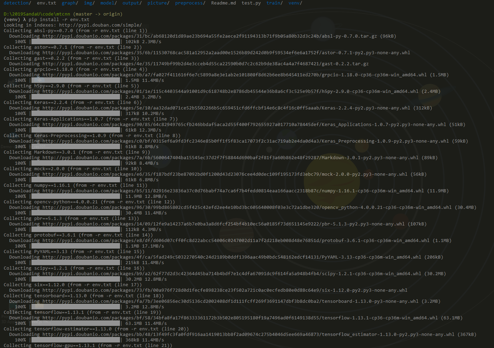

#### About

后台使用的MTCNN 模型相关代码和训练后的model。

- 目录结构：


- 说明

  **model**, **graph** : 训练后的神经网络模型和相关参数权重

  **detection**, **train**, **preprocess** : 训练时使用的相关代码

  **output**, **picture**: 测试输出目录

#### How to use

**环境**：

- win10 
-  python 3.6.x
- 具体package见env.txt

**部署环境(这里使用win 10部署虚拟环境)**

–- 使用virualenv 进行虚拟环境管理(安装**pip install virtualenv**)–- 

- 打开**cmd**进入**mtcnn** 目录

  创建虚拟环境

  > virtualenv  venv  (venv 是当前虚拟环境名称)

  

  激活

  > venv\Scripts\activate.bat 

  

  安装依赖包

  >  pip install -r env.txt 

  

#### 测试

```bash
py test.py
```


## License

This code is distributed under MIT LICENSE

## Citation

[地址](https://kpzhang93.github.io/MTCNN_face_detection_alignment/index.html)

```
@ARTICLE{7553523, 
author={K. Zhang and Z. Zhang and Z. Li and Y. Qiao}, 
journal={IEEE Signal Processing Letters}, 
title={Joint Face Detection and Alignment Using Multitask Cascaded Convolutional Networks}, 
year={2016}, 
volume={23}, 
number={10}, 
pages={1499-1503}, 
keywords={Benchmark testing;Computer architecture;Convolution;Detectors;Face;Face detection;Training;Cascaded convolutional neural network (CNN);face alignment;face detection}, 
doi={10.1109/LSP.2016.2603342}, 
ISSN={1070-9908}, 
month={Oct},}
```